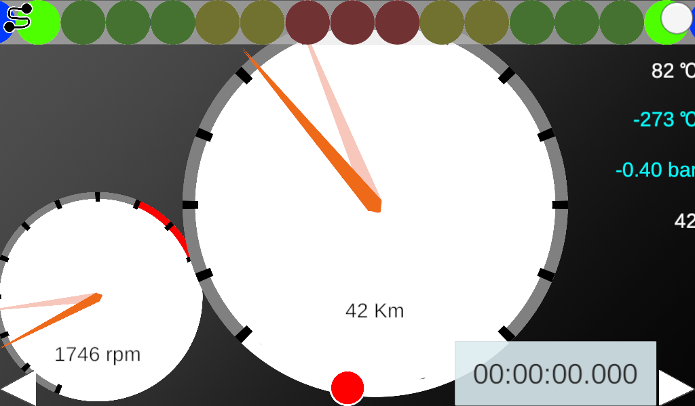
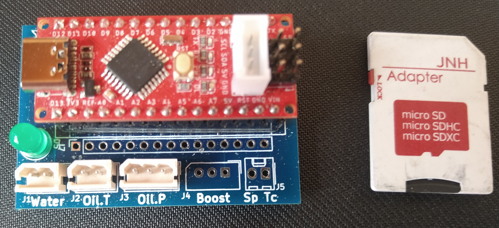

# ArduinoCarDriveLoger
<!-- https://github.com/xx20170204xx/ArduinoCarDriveLoger -->

## description
Android+Arduino+Unityを使ってのマルチメーターを目指したものです。
※水温・油温・油圧計を表示できるようにしたもの

<!--
## Test

-->

## Figure
### Android Client

### Device(Arduino Nano)

### schematic

2022/10/04
<!-- https://docs.github.com/ja/get-started/writing-on-github/getting-started-with-writing-and-formatting-on-github/basic-writing-and-formatting-syntax -->
<!-- EOF -->